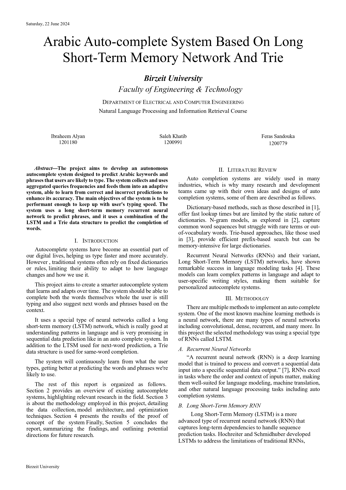
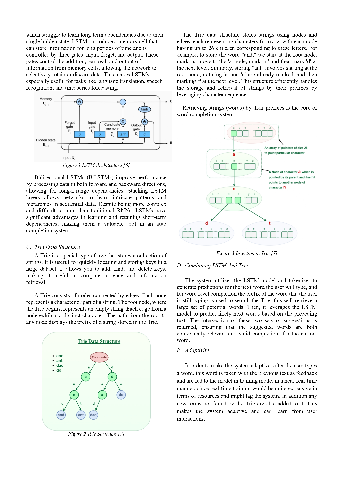
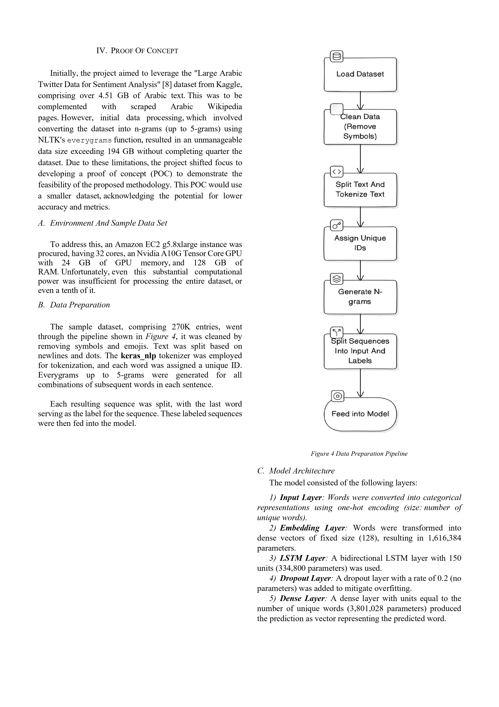
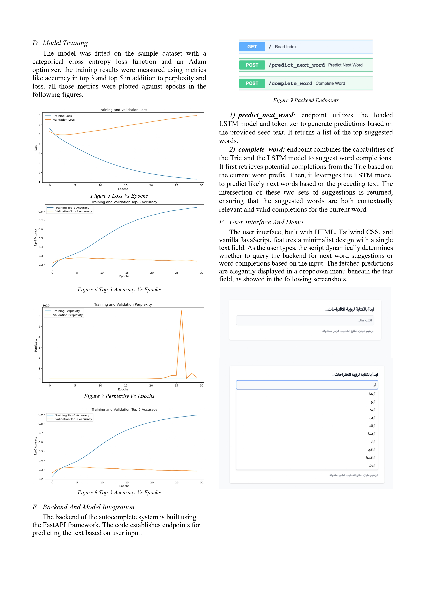
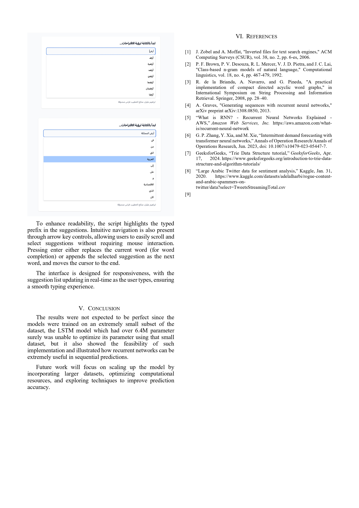

# LSTM Trie AutoComplete System

## Authors

- 👨🏻‍💻 Ibraheem Alyan
- 👨🏻‍💻 Saleh Khatib

## Abstract

The project aims to develop an autonomous
autocomplete system designed to predict Arabic keywords and
phrases that users are likely to type. The system collects and uses
aggregated queries frequencies and feeds them into an adaptive
system, able to learn from correct and incorrect predictions to
enhance its accuracy. The main objectives of the system is to be
performant enough to keep up with user's typing speed. The
system uses a long short-term memory recurrent neural
network to predict phrases, and it uses a combination of the
LSTM and a Trie data structure to predict the completion of
words.

## 🎥 Demo

## 📄 Report

[Project Report](./report/PdfReport_AutoCompleteSystem.pdf)

### Report Preview

<!-- table view of 3 images side by side (project_src/assets/report_preview/AutoCompleteSystem_page-0001.jpg) to 0005 -->

|                                                                     |                                                                     |                                                                     |
| ------------------------------------------------------------------- | ------------------------------------------------------------------- | ------------------------------------------------------------------- |
|  |  |  |
|  |  |                                                                     |
